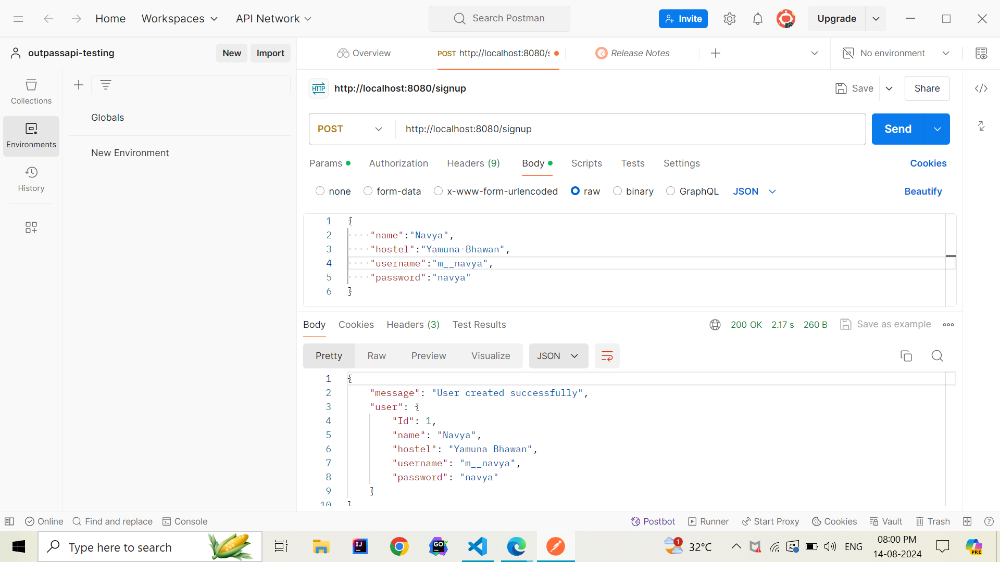
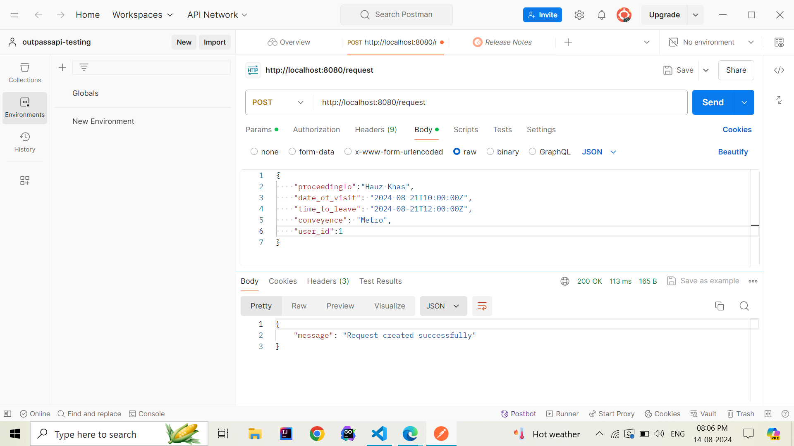
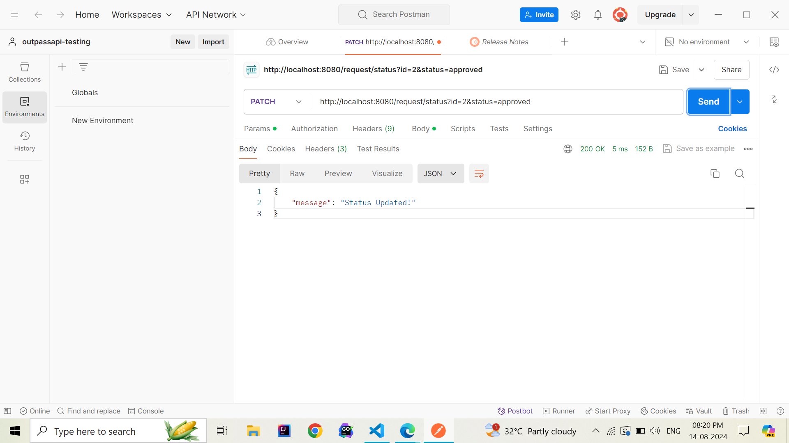

# Outpass 
In many hostel environments, students or residents often need to obtain permission from a warden to leave the premises outside of regular hours. The traditional process can be cumbersome and time-consuming, especially when the warden is unavailable. This can lead to delays and inefficiencies, disrupting both the residents' plans and the warden's workflow.

To address this challenge, I have developed a streamlined application designed to optimize the permission request process. The app allows users to register as either a hosteller or a warden. Hostellers can submit requests to leave the hostel at specific times directly through the app, specifying details such as the destination, time of departure, and mode of conveyance.
On the other side, wardens can instantly view, approve, or decline these requests through a user-friendly interface. The system also maintains a record of all requests and their statuses, ensuring transparency and accountability.

By digitizing and centralizing the permission request process, the app reduces delays, improves communication between hostelers and wardens, and enhances the overall efficiency of hostel management. The application leverages modern technology to solve a common logistical problem, making it a valuable tool for hostel environments.

## API ENDPOINT
The backend API service which is built using Golang provides the following method calls:

| Method  | API URL | Operation |
| ------------- | ------------- | ------------ |
| POST   | /signup | Registers user| 
| POST    | /login | Authenticates user using JWT Token and login |
| POST | /request | Allows user to create a request for leave |
| GET | /requests | Gets all requests |
| GET | /request | Gets all requests of a particular user |
| PATCH | /request/status | Updates status of a particular user |
| GET | /request/status | Gets all requests of a particular status i.e. "completed","pending","declined","approved" |

Register User          
:-------------------------:
    

Create Request          
:-------------------------: 
  

Update Status         
:-------------------------: 
  
